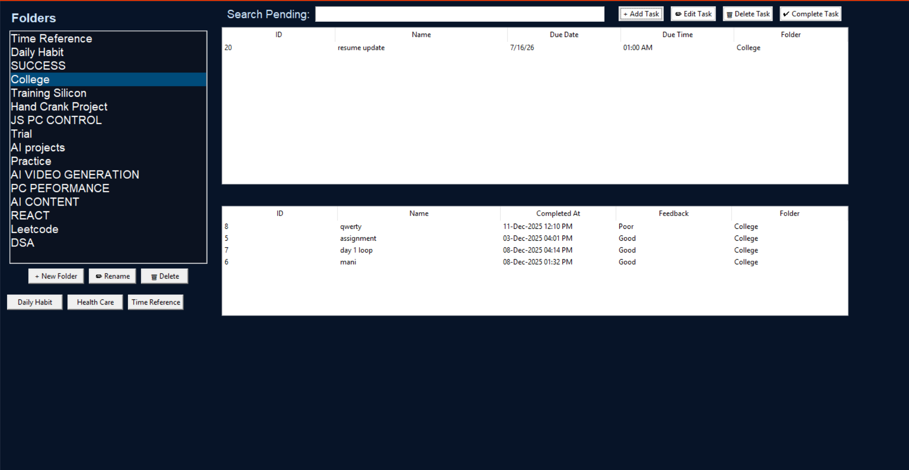
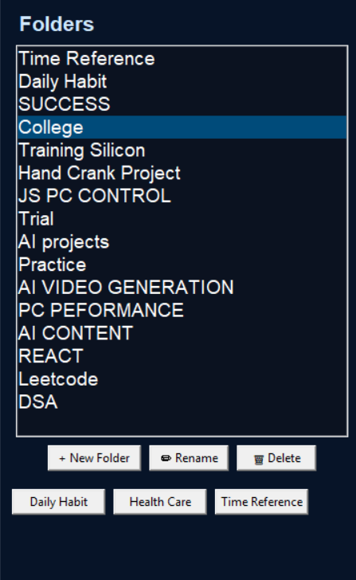
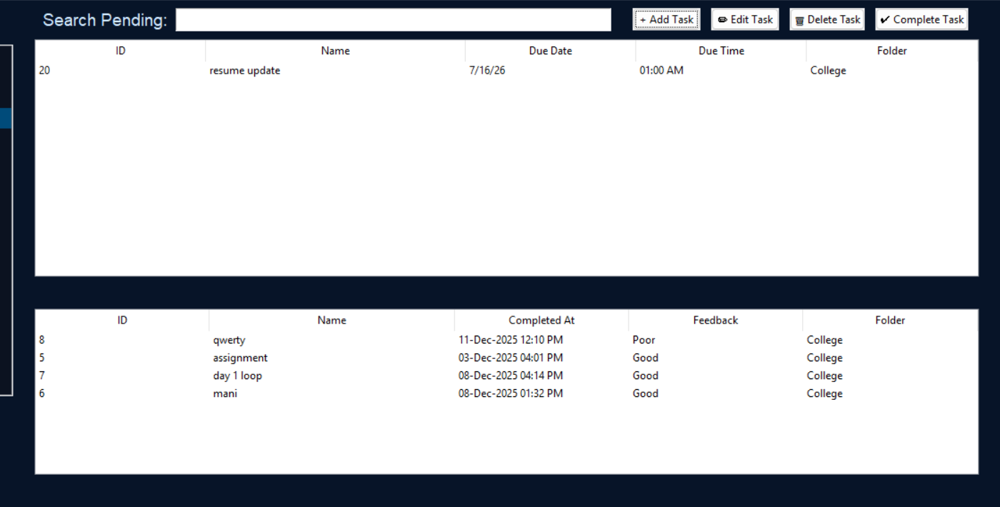
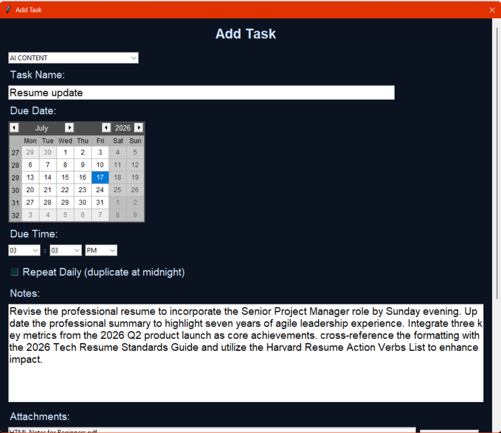

<p align="center">
  
</p>

> **IMPORTANT:** This software is developed for student learning and educational purposes only.

<h1 align="center">JS To-Do-List</h1>

<p align="center">
  <strong>Team: Chip-X | Developer: Jayasubramani S</strong>
</p>

<p align="center">
  <strong>A futuristic, offline task manager featuring rich file attachments.</strong>
</p>

<p align="center">
  <a href="LICENSE"></a>
  
  
  <a href="https://github.com/jayamani2006/Jayamani_JS-To-Do-List/releases/latest"></a>
  
</p>

---

JS To-Do-List is a futuristic, fully offline task manager developed by **Jayasubramani** under the **Chip-X / JS SoftTools** brand. Built as a portfolio project, it features rich file attachments, a unique Time Reference view, a Midnight Watcher for daily tasks, and a standalone Windows executable.

## Table of Contents

- [Features](#features)
- [Screenshots](#screenshots)
- [Demo](#demo)
- [Installation](#installation)
- [Requirements](#requirements)
- [Usage / Controls](#usage--controls)
- [Project Structure](#project-structure)
- [Architecture](#architecture)
- [Building from Source](#building-from-source)
- [Roadmap](#roadmap)
- [FAQ](#faq)
- [Contributing](#contributing)
- [License](#license)
- [Developer](#developer)
- [Support](#support)
- [Acknowledgements](#acknowledgements)

---

## Features

- **Unlimited Folders:** Categorize your tasks efficiently.
- **Rich Attachments:** Add PDFs, DOCX, XLSX, MP3s, and Images directly to tasks.
- **Time Reference View:** Color-coded task urgency and feedback system.
- **Midnight Watcher:** Automatically monitors and rolls over tasks at midnight.
- **Portable Executable:** Single-file `.exe` requires no Python installation.

*See [docs/FEATURES.md](docs/FEATURES.md) for the full feature list.*

---

## Screenshots

<table align="center">
  <tr>
    <td></td>
    <td></td>
  </tr>
  <tr>
    <td align="center"><strong>Main Dashboard</strong></td>
    <td align="center"><strong>Folder Overview</strong></td>
  </tr>
  <tr>
    <td></td>
    <td></td>
  </tr>
  <tr>
    <td align="center"><strong>Task List</strong></td>
    <td align="center"><strong>Task Details View</strong></td>
  </tr>
</table>

---

## Demo

<p align="center">
  
</p>

> 🎥 **[Watch full high-quality MP4 walkthrough (demo.mp4)](assets/demo/demo.mp4)**

---

## Installation

**Portable EXE (Recommended)**
1. Download `JS-To-Do-List-vX.Y.Z-windows-x64.exe` from [Releases](https://github.com/jayamani2006/Jayamani_JS-To-Do-List/releases/latest).
2. Double-click to run instantly. No installation required.

*See [docs/INSTALL.md](docs/INSTALL.md) for detailed instructions.*

---

## Requirements

- **OS:** Windows 10 or 11 (64-bit)
- **Dependencies:** None required for the portable executable. 
- **Storage:** Minimum 50 MB disk space.

---

## Usage / Controls

1. **Open the app.**
2. **Create Folders:** Organize your workflow on the left sidebar.
3. **Add Tasks:** Click "Add Task" to create a new item in your selected folder.
4. **Rich Attachments:** Attach any local files or links to your task.
5. **Complete:** Mark complete and leave feedback/ratings for your tasks.

*See [docs/USER_GUIDE.md](docs/USER_GUIDE.md) for full application instructions.*

---

## Project Structure

<details>
<summary>Click to expand folder tree</summary>

```
JS-To-Do-List/
├── .github/          # GitHub templates & CI workflows
├── assets/           # UI media, banners, screenshots, demo videos
├── docs/             # Technical documentation
├── packaging/        # PyInstaller specs & build scripts
├── sample_data/      # Demo database
├── src/              # Python application source
│   ├── todo_app.py   # Main application logic
│   └── welcome.py    # Neon launcher splash screen
└── [Config Files]    # README, LICENSE, requirements.txt, etc.
```

</details>

---

## Architecture

Built using Python, Tkinter, and an auto-migrating SQLite database, the app implements a robust state-machine pattern to decouple logic from the UI.
- The `js_todo.db` SQLite database is dynamically generated on first launch.
- Local attachments are safely referenced rather than bloating the database.

*Read the full technical breakdown in [docs/PROJECT_ARCHITECTURE.md](docs/PROJECT_ARCHITECTURE.md).*

---

## Building from Source

Want to tinker with the code? You can run it directly or build your own EXE.

1. Clone the repo and set up a venv (`python 3.8+`).
2. `pip install -r requirements.txt`
3. Run directly: `python src/todo_app.py`
4. Build EXE: `packaging/build_app.bat` (or use PyInstaller directly with `.spec`)

*See [docs/BUILD.md](docs/BUILD.md) for detailed build instructions.*

---

## Roadmap

Upcoming features might include:
- Variable difficulty modes
- Cross-platform support
- Enhanced keyboard shortcuts

*See [ROADMAP.md](ROADMAP.md) for the full list of planned ideas.*

---

## FAQ

**Q: Where are attachments stored?**  
A: Inside the `task_attachments/` folder locally on your machine.

*Read more in [docs/FAQ.md](docs/FAQ.md).*

---

## Contributing

Contributions are welcome! Please read [CONTRIBUTING.md](CONTRIBUTING.md) for setup instructions and [CODE_OF_CONDUCT.md](CODE_OF_CONDUCT.md) for community guidelines.

---

## License

This project is licensed under the [MIT License](LICENSE).
Please note the [DISCLAIMER.md](DISCLAIMER.md) regarding usage.

---

## Developer

Developed by **Jayasubramani** under the brand **Chip-X / JS SoftTools**.

---

## Support

Found a bug or have a feature request? Please open an issue on the [GitHub Issues](https://github.com/jayamani2006/Jayamani_JS-To-Do-List/issues) page.

---

## Acknowledgements

- Built with standard library `sqlite3` and `tkinter`
- Utilizes `tkcalendar` and `Pillow`
- Built with PyInstaller

---

> **IMPORTANT:** This software is developed for student learning and educational purposes only. It is a portfolio project and not intended for commercial production use.
