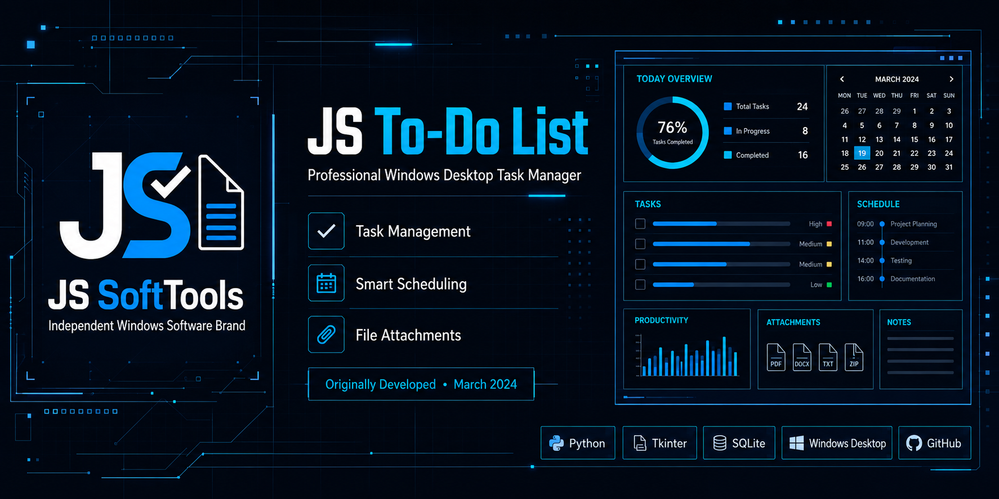
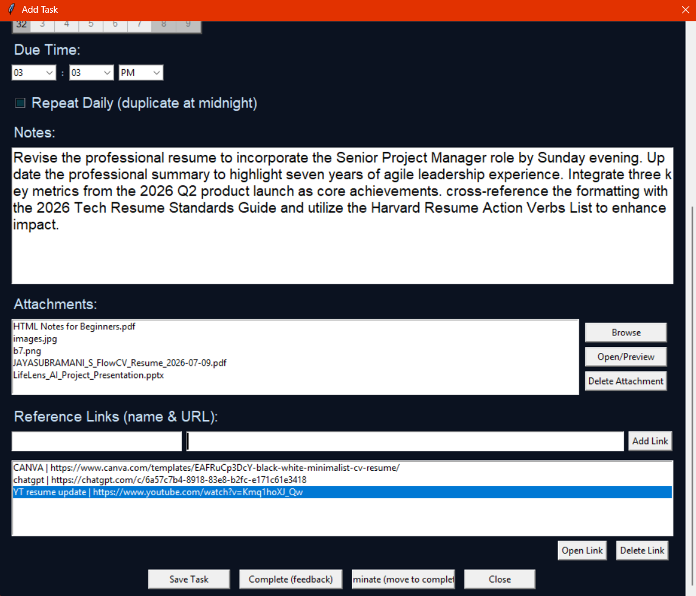
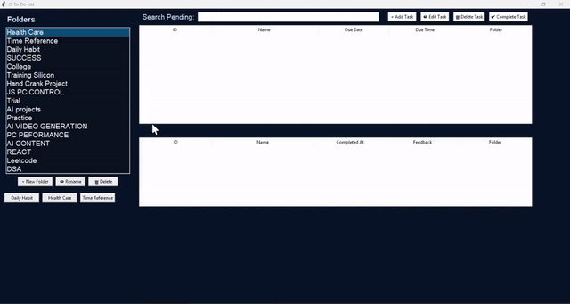

<p align="center">
  
</p>

> **IMPORTANT:** This software is developed for student learning and educational purposes only.

<h1 align="center">JS To-Do-List</h1>

<p align="center">
  <strong>Team: Chip-X | Developer: Jayasubramani S</strong>
</p>

<p align="center">
  <strong>A futuristic, offline task manager featuring rich file attachments and smart task organization.</strong>
</p>

<p align="center">
  <a href="LICENSE"></a>
  
  
  <a href="https://github.com/jayamani2006/Jayamani_JS-To-Do-List/releases/latest"></a>
  
</p>

---

JS To-Do-List is a futuristic, fully offline task manager developed by **Jayasubramani** under the **Chip-X / JS SoftTools** brand. Built as a portfolio project, it features rich file attachments, a unique Time Reference view, a Midnight Watcher for daily tasks, and a standalone Windows executable — all stored 100% locally with no cloud dependency.

## Table of Contents

- [Features](#features)
- [Screenshots](#screenshots)
- [Demo](#demo)
- [Download](#download)
- [Installation](#installation)
- [Installation Location](#installation-location)
- [First Launch](#first-launch)
- [Requirements](#requirements)
- [Usage](#usage)
- [Folder Structure](#folder-structure)
- [Architecture](#architecture)
- [Roadmap](#roadmap)
- [FAQ](#faq)
- [Contributing](#contributing)
- [License](#license)
- [Developer](#developer)
- [Support](#support)
- [Acknowledgements](#acknowledgements)

---

## Features

- **Unlimited Folders** — Categorize your tasks into as many folders as you need.
- **Rich Attachments** — Attach PDFs, DOCX, XLSX, MP3s, and Images directly to any task.
- **Time Reference View** — Color-coded urgency: Green (on track), Yellow (approaching), Red (overdue).
- **Midnight Watcher** — Automatically monitors and rolls over daily/repeating tasks at midnight.
- **Task Feedback System** — Rate completed tasks with emoji-based feedback ratings.
- **Portable Executable** — Single-file `.exe`, no Python installation required.

*See [docs/FEATURES.md](docs/FEATURES.md) for the full feature list.*

---

## Screenshots

<p align="center">
  
  
</p>

<table align="center">
  <tr>
    <td></td>
    <td></td>
  </tr>
  <tr>
    <td align="center"><strong>Main Dashboard</strong></td>
    <td align="center"><strong>Task List View</strong></td>
  </tr>
  <tr>
    <td></td>
    <td></td>
  </tr>
  <tr>
    <td align="center"><strong>Task Details (Top)</strong></td>
    <td align="center"><strong>Task Details (Bottom)</strong></td>
  </tr>
  <tr>
    <td colspan="2" align="center">
      
    </td>
  </tr>
  <tr>
    <td colspan="2" align="center"><strong>Folder Dashboard</strong></td>
  </tr>
</table>

---

## Demo

<p align="center">
  <a href="assets/demo/demo.mp4">
    
  </a>
</p>

> 🎥 **[▶ Watch full HD demo walkthrough (demo.mp4)](assets/demo/demo.mp4)**

---

## Download

<p align="center">
  <a href="https://github.com/jayamani2006/Jayamani_JS-To-Do-List/releases/latest">
    
  </a>
</p>

<p align="center">
  <strong>No installation required — download and double-click to run on Windows 10 / 11.</strong>
</p>

---

## Installation

The application is distributed as a compressed archive. You do not need to install Python or run any complicated setup commands.

1. Click the **Download** button above or go to [Releases](https://github.com/jayamani2006/Jayamani_JS-To-Do-List/releases/latest).
2. Download the compressed archive (`JS-To-Do-List-v1.0.0-windows-x64.zip`).
3. Extract the ZIP file completely to a dedicated folder on your computer.

*See [docs/INSTALL.md](docs/INSTALL.md) for troubleshooting and details.*

---

## Installation Location

For the best experience, the application works best when extracted into its own dedicated folder directly at the root of a drive.

**Recommended installation locations:**
- ✔ `D:\JS-ToDo-List`
- ✔ `E:\JS-ToDo-List`

**If your computer only has a C drive:**
- ✔ `C:\JS-ToDo-List`

**Avoid installing inside these locations:**
- ❌ `C:\Program Files`
- ❌ `C:\Program Files (x86)`
- ❌ Windows System folders
- ❌ Desktop
- ❌ Downloads
- ❌ Deeply nested folders (e.g. `C:\Users\User\Downloads\New Folder\Another Folder\JS-ToDo-List`)

The extracted project folder should remain at the first folder level of the drive whenever possible.

---

## First Launch

Launching the application is simple:

1. Open the extracted folder you created (e.g. `D:\JS-ToDo-List`).
2. Run `JS-To-Do-List-v1.0.0-windows-x64.exe`.
3. The application will automatically generate its required files (such as the database and attachment folders).
4. No installation wizard is required.

---

## Requirements

- **OS:** Windows 10 or 11 (64-bit)
- **Dependencies:** None required for the portable executable.
- **Storage:** Minimum 50 MB disk space.

---

## Usage

1. **Open the app.**
2. **Create Folders** — Use the left sidebar to organize your workflow.
3. **Add Tasks** — Click "Add Task" inside any selected folder.
4. **Attach Files** — Link any local file (PDF, image, audio, document) to a task.
5. **Track Progress** — Use the Time Reference view for color-coded urgency.
6. **Complete & Rate** — Mark tasks complete and leave an emoji feedback rating.

*See [docs/USER_GUIDE.md](docs/USER_GUIDE.md) for full application instructions.*

---

## Folder Structure

When extracted correctly, your application folder will contain the following files:

<details>
<summary>Click to expand folder tree</summary>

```
JS-To-Do-List/
│
├── JS-To-Do-List-v1.0.0-windows-x64.exe  # Main portable application.
├── js_todo.db                            # SQLite database storing tasks (generated on first launch).
├── task_attachments/                     # Stores user attachment files (generated on first launch).
└── data/                                 # Internal data folder (generated on first launch).
```

</details>

---

## Architecture

Built using Python, Tkinter, and an auto-migrating SQLite database (`js_todo.db`).

- The database is dynamically created on first launch — no setup needed.
- Local file attachments are referenced by path, keeping the database lightweight.
- A background thread monitors midnight to auto-reset daily repeating tasks.

*Read the full technical breakdown in [docs/PROJECT_ARCHITECTURE.md](docs/PROJECT_ARCHITECTURE.md).*

---

## Roadmap

- Cross-platform support (Linux, macOS)
- Optional cloud sync (local-first by default)
- Enhanced keyboard shortcuts and accessibility

*See [ROADMAP.md](ROADMAP.md) for the full planned list.*

---

## FAQ

**Q: Where are my attachments stored?**  
A: Inside the `task_attachments/` folder on your local machine.

**Q: Is my data private?**  
A: Yes. Everything is 100% local. No internet connection is ever used.

*Read more in [docs/FAQ.md](docs/FAQ.md).*

---

## Contributing

Contributions are welcome! Please read [CONTRIBUTING.md](CONTRIBUTING.md) for setup instructions and [CODE_OF_CONDUCT.md](CODE_OF_CONDUCT.md) for community guidelines.

---

## License

This project is licensed under the [MIT License](LICENSE).
Please also read [DISCLAIMER.md](DISCLAIMER.md) regarding usage and limitations.

---

## Developer

<p align="center">
  
  &nbsp;&nbsp;&nbsp;
  
</p>

<p align="center">
  Developed by <strong>Jayasubramani</strong> under the brand <strong>Chip-X / JS SoftTools</strong>.<br>
  B.E. Electrical & Electronics Engineering · Knowledge Institute of Technology · Anna University · Class of 2027
</p>

---

## Support

Found a bug or have a feature request? Please open an issue on the [GitHub Issues](https://github.com/jayamani2006/Jayamani_JS-To-Do-List/issues) page.

- 🐛 [Report a Bug](https://github.com/jayamani2006/Jayamani_JS-To-Do-List/issues/new?template=bug_report.md)
- 💡 [Request a Feature](https://github.com/jayamani2006/Jayamani_JS-To-Do-List/issues/new?template=feature_request.md)

---

## Acknowledgements

- Built with Python's standard `tkinter` and `sqlite3` libraries
- Calendar picker powered by [`tkcalendar`](https://tkcalendar.readthedocs.io/)
- Image handling via [`Pillow`](https://pillow.readthedocs.io/)
- Packaged with [PyInstaller](https://pyinstaller.org/)

---

> **IMPORTANT:** This software is developed for student learning and educational purposes only. It is a portfolio project and not intended for commercial production use.
